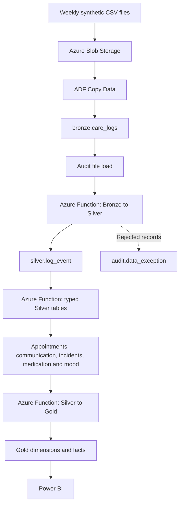
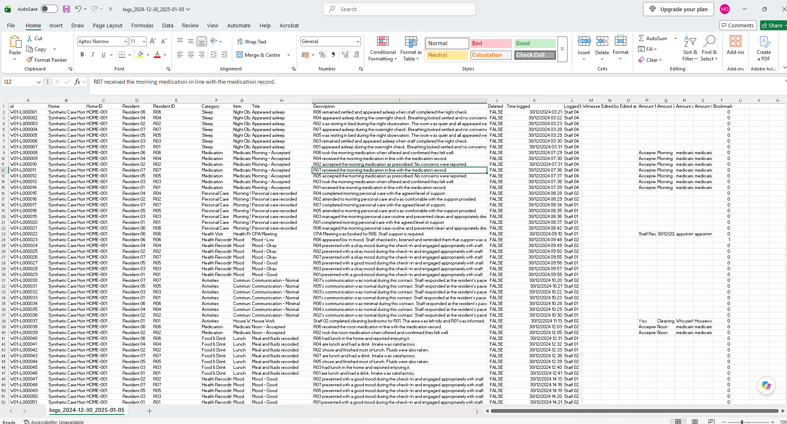

# Care Logs Data Engineering Pipeline

An end-to-end Azure data engineering portfolio project that turns weekly synthetic care-home logs into validated reporting tables and a Power BI management dashboard.

> **Live dashboard:** [Open the Power BI report](https://app.powerbi.com/view?r=eyJrIjoiZGNlYWVkNWUtMGIwNC00ZGNlLThhMTEtN2ZjZTkyY2Y1MzI4IiwidCI6ImNiYTc0NDM4LTI0NGYtNDk3Yy04Y2Y3LTI1Mzg3N2QyNjhmYiJ9)   ·   **Code:** [GitHub repository](https://github.com/Muba730/care-logs-analytics-data-pipeline)
> Built on synthetic data. No real care records are used anywhere in this project.

## Project background

This project is a weekly batch pipeline for synthetic mental health care home records. Support workers and carers enter logs into a care management app, which exports them as weekly CSV files. The files are uploaded to Azure Blob Storage, and Azure Data Factory loads them into Azure SQL Database across Bronze, Silver and Gold layers (medallion architecture). Python and SQL do the cleaning and validation. Power BI reads the Gold layer for the management dashboard.

## Project at a glance

| Area | Details |
| --- | --- |
| **Dataset** | 52 weekly CSV files, 41,345 records, 7 synthetic residents |
| **Tools** | Azure Blob Storage, Azure Data Factory, Azure Functions, Azure SQL Database, Python, SQL, Power BI |
| **Architecture** | Medallion (Bronze, Silver, Gold) with an audit schema |
| **Reporting** | Weekly management view of appointments, wellbeing, medication adherence, incidents and bookmarked logs by support workers/carers |
| **Code** | [github.com/Muba730/care-logs-analytics-data-pipeline](https://github.com/Muba730/care-logs-analytics-data-pipeline) |
| **Dashboard** | [Open the Power BI report](https://app.powerbi.com/view?r=eyJrIjoiZGNlYWVkNWUtMGIwNC00ZGNlLThhMTEtN2ZjZTkyY2Y1MzI4IiwidCI6ImNiYTc0NDM4LTI0NGYtNDk3Yy04Y2Y3LTI1Mzg3N2QyNjhmYiJ9) |

### Business requirement

Care home managers need a weekly view of staff-supported appointments, resident wellbeing, medication adherence, incidents and important care logs. This helps them arrange staff cover for appointments, prioritise follow-up and respond to changes in resident needs. They also need to look at monthly and longer-term trends to spot recurring patterns and adjust care plans, which is hard to do from the individual logs.

### Solution

Weekly CSV files are loaded into the Bronze layer, cleaned and validated in Silver, then transformed into Gold tables for Power BI. Azure Data Factory orchestrates the pipeline and calls Azure Functions to run the Python transformations. The dashboard provides managers with weekly operational oversight and longer-term wellbeing trends, while audit records, exception handling and source-file lineage keep each load traceable.

## Contents

- [Project background](#project-background)
- [Project at a glance](#project-at-a-glance)
- [Solution architecture](#solution-architecture)
- [Data](#data)
- [Project repository](#project-repository)
- [Data model](#data-model)
- [Pipeline orchestration](#pipeline-orchestration)
- [Data cleaning and transformation](#data-cleaning-and-transformation)
- [Power BI report](#power-bi-report)
- [Findings and operational value](#findings-and-operational-value)
- [Setup and validation](#setup-and-validation)
- [Limitations and future improvements](#limitations-and-future-improvements)

## Solution architecture

The pipeline is split into orchestration, transformation, storage and reporting. Bronze, Silver and Gold are schemas in Azure SQL Database.



| **Component** | **Responsibility** |
| --- | --- |
| Azure Blob Storage | Stores the weekly CSV files from the source system. |
| Azure Data Factory | Runs the pipeline: ingestion, audit logging and the three transformation steps. |
| Bronze | Raw source rows plus the filename and ingestion timestamp. |
| Silver | Cleaned and validated records, split into event tables by subject (appointments, mood, medication, etc.). |
| Gold | Dimensions and fact tables shaped for the Power BI measures. |
| Power BI | Weekly and longer-term views for managers. |

## Data

The dataset is synthetic and privacy-safe, based on operational experience in the care sector. It has 41,345 care logs for seven residents across 52 Monday-to-Sunday CSV files. The records cover what support workers would normally log day to day: wellbeing, medication, incidents, appointments and activities.



### How the data was generated

The data was generated against a set of business and data quality rules rather than randomly. These rules set the 20-column schema, resident and staff IDs, allowed values, appointment statuses, how often events happen and daily record volumes. Each resident has 15 to 18 logs per day. Validation checks covered required fields, timestamps, duplicate IDs, weekly date boundaries and the link between appointment bookings and their separately recorded outcomes.

### Linked events

Events were linked across weeks so there are realistic patterns to analyse: recurring changes in mood and communication, medication refusals, incidents, bookmarked management actions, care team follow-ups, financial stress support and overlapping staff-supported appointments. Some exceptions were added on purpose, such as low wellbeing with no incident and falls with no earlier mood or communication warning, so the data does not imply that one always causes the other.

### File structure

Weekly files are named `logs_YYYY-MM-DD_YYYY-MM-DD.csv`. The filename is kept as `source_file` through every layer, which provides lineage and lets a rerun replace the previous batch without adding duplicates.

## Project repository

The repository holds the Python and SQL for the pipeline, an ADF configuration reference, validation queries and tests.

```text
care-logs-analytics-data-pipeline/
├── README.md
├── .gitignore
├── azure_functions/
│   ├── .funcignore
│   ├── __init__.py
│   ├── function_app.py
│   ├── database.py
│   ├── silver_loader.py
│   ├── gold_loader.py
│   ├── requirements.txt
│   ├── host.json
│   └── local.settings.example.json
├── adf/
│   ├── README.md
│   ├── adf_pipeline_overview.png
│   └── pipeline1.reference.json
├── sql/
│   ├── ddl_statement/
│   │   ├── 01_bronze.sql
│   │   ├── 02_audit.sql
│   │   ├── 03_silver.sql
│   │   ├── 04_gold_dimensions.sql
│   │   └── 05_gold_facts.sql
│   └── validation/
│       └── layer_row_counts.sql
├── data/
│   ├── README.md
│   └── synthetic_data_sample.png
├── powerbi/
│   └── README.md
├── docs/
│   └── implementation-notes.md
└── tests/
    └── test_silver_loader.py
```

The main parts are:

- **SQL DDL scripts** – create the Bronze, Audit, Silver and Gold tables with primary keys, foreign keys and constraints. [sql/ddl_statement](sql/ddl_statement)
- **Azure Function** – the endpoints Azure Data Factory calls to run the Python transformations and return the load results. [azure_functions/function_app.py](azure_functions/function_app.py)
- **Silver loader** – reads the Bronze rows for the file, cleans and validates them, derives reporting fields and loads the Silver tables. [azure_functions/silver_loader.py](azure_functions/silver_loader.py)
- **Gold loader** – builds the dimension and fact tables from Silver for the Power BI dashboards. [azure_functions/gold_loader.py](azure_functions/gold_loader.py)

## Data model

Bronze keeps the ingested rows as they arrived, Silver standardises them into care events, and Gold reshapes the validated data for reporting.
Silver has one `log_event` table that the typed tables (appointment, communication, incident, medication and mood) all link back to. Gold has shared Date and Resident dimensions used by every fact table. Staff attribution supports review of bookmarked logs; the repository also retains staff relationships for incident reporting.

### Physical schema

Each layer has its own keys. Bronze creates `bronze_log_key` and keeps `source_log_id`. Silver creates `log_event_key`, and each typed Silver table links back to it. Gold creates new surrogate keys for the facts and uses foreign keys to `dim_date` and `dim_resident`. For example, `silver.mood.mood_event_key` and `gold.fact_mood_daily.mood_daily_key` are different keys because one Gold daily row can summarise several Silver mood events.

## Pipeline orchestration


Azure Data Factory runs the weekly sequence. Each activity only runs if the previous one succeeded, so downstream tables are not updated after a failed load.

### Weekly processing sequence

1. Copy the selected weekly CSV from Blob Storage into `bronze.care_logs`.
2. Add the pipeline `fileName` parameter to every row as `source_file`.
3. Insert an `audit.pipeline_run` record with the filename, copied row count and load status.
4. Call the first Azure Function to clean and validate the Bronze rows into `silver.log_event`.
5. Call the second Azure Function to reload the subject-specific Silver tables.
6. Call the third Azure Function to build the Gold dimension and fact tables.

### Rerunning a file

The Bronze Copy Data activity runs this pre-copy script before inserting the file into `bronze.care_logs`:

```sql
DELETE FROM bronze.care_logs
WHERE source_file = '@{pipeline().parameters.fileName}';
```

Deleting the file's rows first means the same week can be rerun without duplicating Bronze records. `ingestion_timestamp` is not mapped by ADF, so SQL fills it with the column default `SYSUTCDATETIME()` on insert.

### Audit and exceptions

After the Bronze copy, a stored procedure writes a row to `audit.pipeline_run` with the `source_file`, copied row count and run status. Rows that fail validation go to `audit.data_exception` and are excluded from the Silver and Gold tables. Deleted records and duplicates are filtered without being treated as validation failures.

## Data cleaning and transformation

I used Python in Azure Functions to clean the weekly care logs and prepare them for reporting. Each run processes only the current source file, while the original records remain in Bronze for traceability.

### Cleaning and standardising the records

The synthetic dataset follows controlled app options, so cleaning focused on formatting, data types and validation. Examples of the implemented rules include:

| **Task** | **Example** | **Purpose** |
| --- | --- | --- |
| Clean descriptions | Remove leading spaces and replace repeated spaces, tabs and line breaks with single spaces | Make notes easier to read without changing their wording |
| Convert timestamps | Parse `03/01/2025 22:14` into a datetime value | Allow accurate sorting and grouping |
| Standardise staff names | Convert `staff2` to `Staff 02` | Keep staff identifiers consistent |
| Convert flags | Convert values such as `Yes` and `True` into Boolean fields | Apply consistent filtering for bookmarked and deleted records |

Deleted records are excluded from Silver, and source log IDs are checked within each file to prevent duplicate loading. The validated records are then transformed into the summaries and event tables needed for reporting.

### Transforming records for reporting

- **Mood and communication:** Map labels to scores—1–5 for mood and 1–4 for communication—then calculate daily averages and log counts by resident. For example, `Minimal`, `Minimal` and `Normal` produce an average communication score of **2.33**. Days without entries retain a zero log count and a blank average, distinguishing missing information from low wellbeing.
- **Medication:** Extract outcomes and medication rounds into named fields, then aggregate accepted, refused and PRN dose counts by resident and week. Power BI uses the accepted and refused totals to calculate adherence: **accepted ÷ (accepted + refused) × 100**.
- **Appointments:** Extract scheduled dates, times and staff-support requirements. The prototype applies a 90-minute duration to bookings and flags overlapping staff-supported appointments within each weekly batch. Bookings are reported against their scheduled date; completion and cancellation logs remain separate events and are not automatically matched back to bookings.
- **Incidents:** Retain one record per incident, including its resident, date, type and description. Power BI can then count incidents across different periods while preserving the underlying details.
- **Bookmarked notes:** Filter bookmarked records into a dedicated Gold table, retaining the cleaned note, resident, timestamp, staff member and source reference. This supplies the Important Logs view and keeps concerns and follow-up actions available as separate, chronological records.

## Power BI report

The report has two pages built on the Gold tables: Weekly Overview and Resident Wellbeing.

### Weekly Overview

This page is for the manager's weekly review. The Selected Week filter picks the week, and earlier weeks stay available for comparison.

- **Residents:** number of residents with records in the selected week.
- **Scheduled appointments:** all appointments planned for the week.
- **Appointment conflicts:** overlapping staff-supported appointments that may need reassigning or extra cover.
- **Resident alerts:** residents with low or very low mood, or no recorded communication.
- **Appointment workload:** seven-day schedule showing appointment demand and conflicts.
- **Important logs:** staff-bookmarked notes shown as a short preview. The full note is on the Resident Wellbeing page.

### Resident Wellbeing

A Select Resident filter in the top right corner applies to every visual on the page, including the incident chart, so the manager can look at all residents or narrow the whole page to one person.

- **Monthly trend:** mood or communication scores over time. The Month view shows the weekly average for each week of the selected month. The Year view shows the monthly average for each month of the selected year, with a line for each resident.
- **Weekly wellbeing:** each resident's daily average, with colour highlighting lower scores.
- **Medication adherence:** accepted doses as a percentage of doses offered, with Week and Month views.
- **Incident patterns:** incident totals over time, with Month and Year views. This chart follows the resident filter like the others, so incidents can be viewed for one resident or the whole home.
- **Important logs:** full staff-bookmarked notes for the selected week, and a count of those still to review.

Mood and communication can be checked weekly or compared across months. A drop can be traced to the resident and date, then checked against the bookmarked notes, medication refusals and incidents for the same period.

### Semantic model

The data model is a star schema. The Date and Resident dimensions filter all the fact tables, so measures stay consistent between the weekly and longer-term views. The documented dashboard uses Staff for bookmarked logs. The repository also defines a Staff relationship for incident facts; see the [Power BI notes](powerbi/README.md).

## Findings and operational value

The following examples come from the synthetic dataset. They demonstrate how the dashboard can support operational review; they are not measured outcomes from a real care service.

### 1. Recurring resident support needs

Changes in mood, communication, medication and incidents were sometimes linked rather than isolated. R01 and R02 are the clearest examples.

#### R01 recurring episode pattern

R01 had recurring episodes in January, April, July and October. Each one usually went from low mood and reduced communication to medication refusal and then an incident. Refusals went from one in January to two in April and three in July, each followed by a bookmarked management record. The major incidents in January and July led to care team involvement; the minor incidents in April and October were handled with one-to-one support. Seeing these records together helps a manager spot the pattern earlier.

| **Signal** | **January**<br>Weeks 3–5 | **April**<br>Weeks 14–16 | **July**<br>Weeks 28–30 | **October**<br>Weeks 41–43 |
| --- | --- | --- | --- | --- |
| Mood | Low | Low | Low | Low |
| Communication | Minimal | Minimal / none | Minimal | Minimal |
| Medication | 1 refusal | 2 refusals | 3 refusals | Refusal recorded |
| Bookmarked action | Care team emailed | Manager intervention | Care team emailed | Manager intervention |
| Outcome | Major incident, care team meeting scheduled | Minor incident, staff and manager 1-to-1 | Major incident, care team meeting scheduled | Minor incident, staff and manager 1-to-1 |

#### R02 financial stress pattern

R02's mood and communication dropped in January, February and March shortly before his monthly payment, as funds ran low. After the second time, the manager involved the care team and arranged budget support, and staff helped with essentials. Similar issues came up later in the year and were picked up through the wellbeing changes and bookmarked notes.

**In the dashboard:** for R01 see Weeks 3–5, 14–16, 28–30 and 41–43. For R02 compare Week 3 (13–19 January), Week 8 (17–23 February) and Week 12 (17–23 March), then Week 13 (24–30 March) for the improvement.

### 2. Bookmarked follow-up trail

Incidents, sustained low mood or reduced communication, and staff or manager follow-up notes were bookmarked so they appear in the dashboard review queue. Each concern can be followed through the related bookmarks: a staff one-to-one, a manager note confirming the care team was informed, and a care team meeting in a later week. Keeping each action as a separate record gives a traceable sequence from concern to escalation, follow-up and monitoring.

- **R06, Weeks 20–21:** a self-harm concern, followed by a bookmarked manager notification in Week 20 and a care team follow-up meeting in Week 21.
- **R04, Weeks 25–27:** verbal aggression and assault bookmarked separately in Week 25, follow-up meetings and a revised support approach in Week 26, and more stable records in Week 27.
- **R01, Weeks 29–31:** incidents and medication refusals in Weeks 29–30 with separate bookmarked management logs and care team follow-ups. Week 31 shows the improvement in mood, communication and medication acceptance.

**In the dashboard:** Weeks 20–21 for R06, 25–27 for R04 and 29–31 for R01. Filter the review queue to bookmarked logs to follow each one from notification to care team response.

### 3. Appointment conflicts

The appointment view flags weeks where two overlapping appointments both need staff support, meaning extra cover is needed. Spotting these ahead of time lets the manager arrange cover early instead of relying on emergency or agency staff.

**In the dashboard:** Weeks 12, 13, 15, 17, 20 and 25. Week 25 is the clearest example: the overlapping bookings are visible and a separate completion record shows that cover staff attended.

## Setup and validation

The repository contains the transformation code, database scripts and a sanitised ADF reference. The full weekly CSV dataset and Power BI `.pbix` file are not included.

### 1. Create the database tables

In a new Azure SQL Database, run the scripts in this order:

1. [Bronze](sql/ddl_statement/01_bronze.sql)
2. [Audit](sql/ddl_statement/02_audit.sql)
3. [Silver](sql/ddl_statement/03_silver.sql)
4. [Gold dimensions](sql/ddl_statement/04_gold_dimensions.sql)
5. [Gold facts](sql/ddl_statement/05_gold_facts.sql)

The Gold loader seeds the Date, Resident, Staff and Log Type dimensions before loading the reporting tables.

### 2. Configure and deploy Azure Functions

Install the Python dependencies from the repository root:

```bash
python -m pip install -r azure_functions/requirements.txt
```

Copy [local.settings.example.json](azure_functions/local.settings.example.json) to `azure_functions/local.settings.json` for local development and replace the placeholders. Configure the corresponding Function App environment variables in Azure, including `SQL_CONNECTION_STRING`, `VALID_RESIDENT_IDS` and `VALID_LOGGED_BY`. The sample uses development storage for local runs.

Deploy from the `azure_functions` directory so `host.json`, `requirements.txt` and `function_app.py` are at the Function project root. Keep passwords, connection strings, Function keys and `local.settings.json` out of source control.

All three endpoints accept HTTP POST and use Function-level authentication:

| Function | HTTP route |
| --- | --- |
| `LoadBronzeToSilverLogEvent` | `load-bronze-to-silver-log-event` |
| `LoadSilverLogEventToSilverTables` | `load-silver-log-event-to-silver-tables` |
| `LoadSilverTablesToGold` | `load-silver-tables-to-gold` |

Each endpoint expects a source filename:

```json
{
  "source_file": "logs_2024-12-30_2025-01-05.csv"
}
```

An `audit.pipeline_run` record must already exist for that file. The endpoints return HTTP 409 if the audit record is missing.

### 3. Configure ingestion and run the pipeline

Use the [ADF configuration guide](adf/README.md) and [sanitised pipeline reference](adf/pipeline1.reference.json) to configure the Blob CSV source, Azure SQL destination and Azure Function activities for your own Azure resources. The reference is not a complete infrastructure deployment.

Upload a compatible synthetic weekly CSV, set the `fileName` pipeline parameter and run the sequence described above. Bronze ingestion uses the built-in ADF Copy Data activity.

### 4. Validate the data and connect Power BI

Run the existing Silver unit tests from the repository root:

```bash
python -m unittest discover -s tests
```

The tests cover whitespace cleaning, shift boundaries, appointment time parsing and rejection of unknown resident IDs and mood labels.

After processing the dataset, run [layer_row_counts.sql](sql/validation/layer_row_counts.sql) and inspect `audit.pipeline_run` and `audit.data_exception`.

Import the Gold reporting tables into Power BI. Keep Bronze, Silver and Audit tables outside the reporting model. Power BI refresh is currently separate from the pipeline.

See [implementation notes](docs/implementation-notes.md) for the final modelling decisions, including separate appointment booking and outcome events, the seven-resident roster and shifts derived from logging timestamps.

## Limitations and future improvements

This is a prototype. For a production version it would need the following.

| **Area** | **Current state** | **Next step** |
| --- | --- | --- |
| Data governance and metadata | Lineage, audit records and validation exist, but there is no formal metadata management. | Add a data catalogue, business glossary, ownership, retention rules and end-to-end lineage (e.g. Microsoft Purview). |
| Follow-up actions | Bookmarked notes show concerns and follow-up, but actions and outcomes are not stored as structured fields. | Add action, owner, due date, status and outcome fields so open, completed and overdue follow-ups can be tracked. |
| Testing and deployment | Prototype environment; Silver unit tests and source control are present, but automated deployment is not included. | Expand test coverage, version SQL changes, and add CI/CD with separate development and production environments. |
| Business rules and refresh | Some thresholds are hard-coded in the transformation and report logic, and the Power BI refresh is separate from the pipeline. | Move thresholds into configuration tables and trigger the Power BI refresh after a successful Gold load. |
| Monitoring and security | Audit tables record pipeline activity, but there is no monitoring layer or production security setup. | Add monitoring and alerting, RBAC, managed identities, Key Vault, private endpoints and data access controls. |
