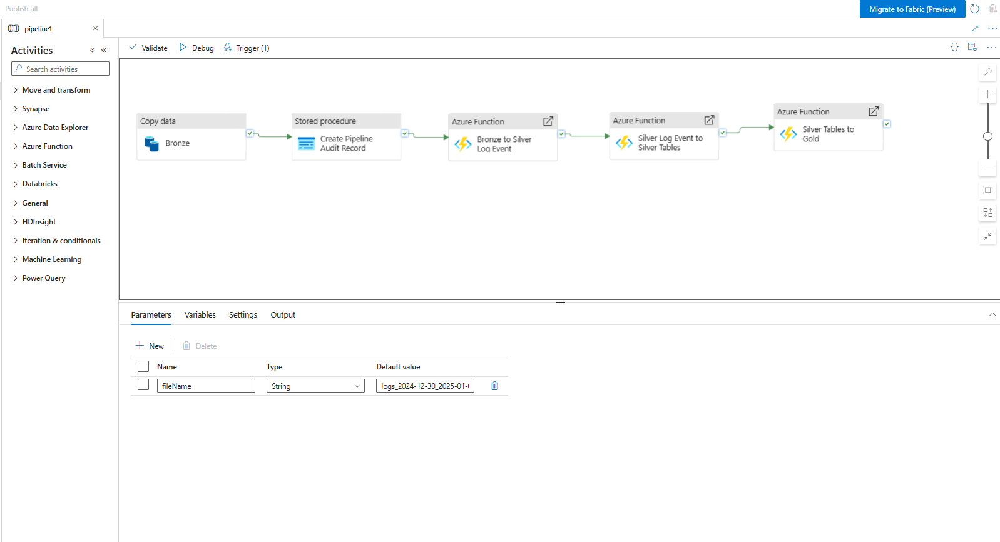

# Azure Data Factory Orchestration

Azure Data Factory (ADF) controls the order in which each stage of the pipeline runs.



## Pipeline process

1. The Bronze Copy Data activity reads the selected weekly CSV from Azure Blob Storage and loads the rows into bronze.care_logs.

2. ADF adds the filename to every row through the source_file column. This provides data lineage and identifies which weekly file each record came from.

3. After the copy succeeds, a stored procedure creates a record in audit.pipeline_run, capturing the filename, number of rows received and load status.

4. The first deployed Azure Function cleans and validates the Bronze records before populating silver.log_event.

5. The second Azure Function separates the validated events into the relevant Silver tables.

6. The final Azure Function transforms the Silver data into reporting-ready Gold tables.

Each activity depends on the successful completion of the previous activity. This prevents the transformation stages from running when the Bronze load or audit step fails.

## Bronze Copy Data configuration

The Copy Data activity uses:

- Azure Blob Storage as the source.
- A parameterised CSV dataset to select the weekly file.
- Azure SQL Database as the destination.
- bronze.care_logs as the sink table.
- The pipeline's fileName parameter to populate source_file.
- A SQL default of SYSUTCDATETIME() to populate ingestion_timestamp.

Before loading a file, the following pre-copy query removes any previous Bronze rows for that filename:

```sql
DELETE FROM bronze.care_logs
WHERE source_file = '@{pipeline().parameters.fileName}';
```

This makes the Bronze load idempotent: rerunning the same weekly file replaces its earlier rows instead of creating duplicates.

The sanitised pipeline1.reference.json file documents the ADF configuration without exposing connection strings, passwords or Function keys.
